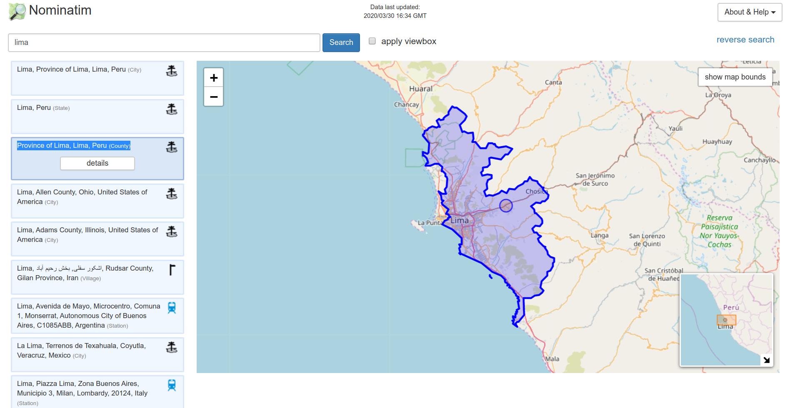
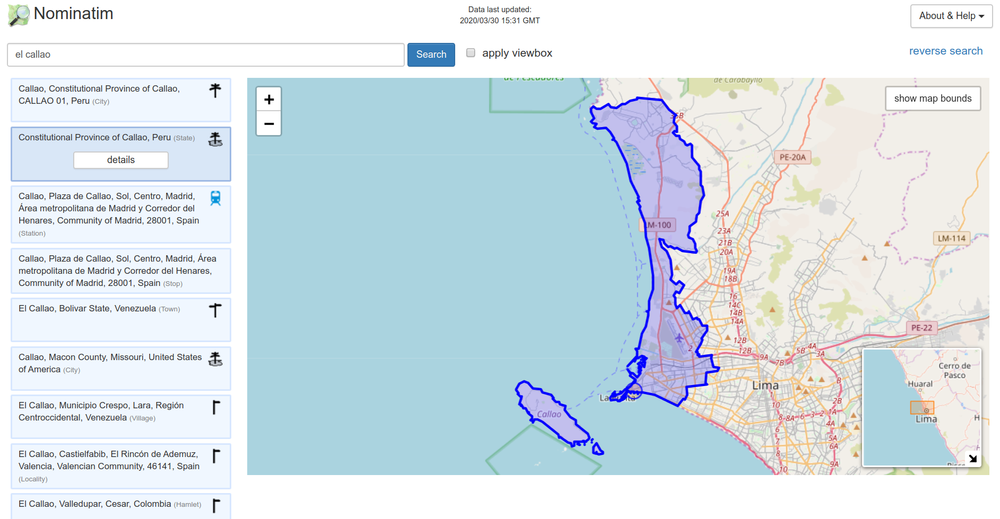

```{r, echo=FALSE}
htmltools::img(src = knitr::image_uri("img/BID_logo.png"), 
               alt = 'logo', 
               style = 'position:absolute; top:0; right:0; padding:10px;')
```

```{r setup, include=FALSE}
knitr::opts_chunk$set(echo = TRUE, message = FALSE, warning = FALSE)
```

## Objetivo

Realizar mapas con la mayor granularidad posible, a escala intraurbana, de vulnerabilidad social ante la pandemia de COVID-19.

Con ello se busca contribuir en la toma de decisiones por parte de entidades municipales para la planificación y distribución de atención a nivel intraurbano (víveres con bancos de comida, atención médica in situ, etc.).

En esta instancia se utilizarán solo fuentes abiertas con cobertura global, de modo que el procedimiento sea reproducible en cualquier ciudad de Latinoamérica sin requerir fuentes locales específicas. Por supuesto, los datos locales de gran valor y podrán ser incorporados a éste procedimiento para refinar o extender los resultados.

Esta prueba de concepto toma a Lima, Perú, como ubicación a analizar.


## Fuentes de datos 

- __OpenStreetMap__ : datos de grilla vial pública, ubicación de hospitales y centros de salud, farmacias, tiendas y mercados donde comprar comida, etc.
- __Facebook Humanitarian Data__ : Densidad de población por rango etario - en particular +60 años


### Paquetes a utilizar

```{r}
library(tidyverse) # funciones útiles en general para manipulación y visualización
library(sf) # para datos georeferenciados en formato vectorial
library(osmdata) # para acceso a datos de OpenStreetMap
library(leaflet) # para visualización de datos geográficos
library(nngeo) # para identificar elementos próximos en el espacio  
               # No disponible en CRAN, usar devtools::install_github("michaeldorman/nngeo")

```


## Descarga de datasets

### Estimados demográficos

#### Población general

Descargamos los datos de [estimados demográficos para Perú producidos por Facebook](https://data.humdata.org/dataset/peru-high-resolution-population-density-maps-demographic-estimates)

```{r}
url <- "https://data.humdata.org/dataset/4e74db39-87f1-4383-9255-eaf8ebceb0c9/resource/317f1c39-8417-4bde-a076-99bd37feefce/download/population_per_2018-10-01.csv.zip"

zipfile <- tempfile()
download.file(url, zipfile)
filename <- unzip(zipfile, list = TRUE)$Name

densidad <- read_csv(unz(zipfile, filename))

unlink(zipfile)

```


El dataset contiene puntos definidos por pares de coordenadas en proyección Mercator, y estimados de población en torno a esa posición en 2015 y 2020, para todo Ecuador:

```{r}
head(poblacion)
```

Cada par latitud/longitud representa un área que corresponde a 1 segundo de arco de resolución (aproximadamente 30m x 30m)

#### Población mayor a 60 años

De la misma fuente descargamos la cantidad estimada de personas de más de 60 años

```{r}
url <- "https://data.humdata.org/dataset/4e74db39-87f1-4383-9255-eaf8ebceb0c9/resource/8cc100cf-68a4-4fda-a8e6-a63b99ad5b00/download/per_elderly_60_plus_2019-06-01_csv.zip"

zipfile <- tempfile()
download.file(url, zipfile)
filename <- unzip(zipfile, list = TRUE)$Name

personas_mayores <- read_csv(unz(zipfile, filename))

unlink(zipfile)
```


En este caso el dataset contiene el estimado de personas mayores a 60 años viviendo en el área que corresponde a cada punto:

```{r}
head(personas_mayores)
```

## Límites de la ciudad

El polígono de las fronteras administrativas de la ciudad puede encontrarse en Nominatim: https://nominatim.openstreetmap.org/

Debido a la infinidad de marcos territoriales y legales que existen en el mundo para definir las fronteras de las ciudades, en general existen varias formas de interpretar cuales son los límites de una ciudad. 

Nominatim es una base de datos global de nombres propios de lugares. Al realizarse una búsqueda, por ejemplo por "Lima", se encuentran distintas entidades geográficas con ese nombre. La interfaz de Nominatim permite comparar opciones y verificar los límites en el mapa, identificando la entidad buscada. 

Por la particular configuración territorial de este caso, necesitamos dos regiones que combinadas forma la Lima Metropolitana: Lima y el Callao.

En cada caso, hacemos la busqueda y determinamos cual de los resultados es el que necesitamos:

```{r out.width="800px", echo=FALSE}

```

```{r out.width="800px", echo=FALSE}

```

Province of Lima, Lima, Peru (County)


Para Lima, las fronteras que buscamos son las del tercer resultado (_Province of Lima, Lima, Peru (County)_). Para el Callao, la segunda (_Constitutional Province of Callao, Peru (State)_) 

Descargamos los límites:

```{r }
ciudad <- "Lima, Peru"
# La posición en que aparece entre los resultados de Nominatim 
posicion <- 3

url <- URLencode(paste0("https://nominatim.openstreetmap.org/search.php?q=",
                        ciudad, "&polygon_geojson=1&format=geojson"))

destfile = paste0(tempdir(), "/limits.json")

download.file(url, destfile)

limites_lima <- st_read(destfile)[posicion,]
```

```{r}
ciudad <- "Callao, Peru"
# La posición en que aparece entre los resultados de Nominatim 
posicion <- 2

url <- URLencode(paste0("https://nominatim.openstreetmap.org/search.php?q=",
                        ciudad, "&polygon_geojson=1&format=geojson"))

destfile = paste0(tempdir(), "/limits.json")

download.file(url, destfile)

limites_callao <- st_read(destfile)[posicion,]
```


```{r}
limites <- st_union(limites_lima, limites_callao)
```


```{r}
leaflet(limites) %>%
    addProviderTiles(providers$CartoDB.Positron) %>% 
    addPolygons() 
```


### Puntos de Interés

Para obtener datos georeferenciados locales realizaremos consultas a Overpass (http://overpass-api.de/), una interfaz que permite extraer información de la base de datos global de OpenStreetMap. 

Overpass requiere que se especifique una “bounding box”, es decir las coordenadas de un rectángulo que abarque la zona de interés (en la práctica, los valores máximos y mínimos de latitud y longitud). 

La generamos:

```{r}
bbox <- matrix(st_bbox(limites), nrow = 2, dimnames = list(c("x", "y"), c("min", "max")))

bbox
```

Para descargar entidades georeferenciadas se requiere conocer las palabras clave con las que se identifican los registros en la base de OSM. Existe gran detalle para el tipo de datos georeferenciados disponibles: áreas de parques públicos, posición de oficinas de correo o cajeros automáticos, vías de ferrocarril, etc. La nomenclatura se puede consultar en https://wiki.openstreetmap.org/wiki/Map_Features

En este caso vamos a solicitar todas las vías de circulación (calles, avenidas, autopistas, etc) de la ciudad. En la base de datos de OSM ciertas entidades agrupadas bajo la categoría "Healthcare" resultan de inmediato interés:


| key     | value    | description                                           |
|---------|----------|-------------------------------------------------------|
| amenity | clinic   |     A medium-sized medical facility or health centre. |
| amenity | hospital |     A hospital providing in-patient medical treatment |
| amenity | pharmacy | Pharmacy: a shop where a pharmacist sells medications |


Para esta prueba de concepto descargaremos clínicas y hospitales. 

```{r }
clinicas <-  opq(bbox) %>% 
  add_osm_feature(key = "amenity", value = "clinic") %>% 
  osmdata_sf() 

hospitales <-  opq(bbox) %>% 
  add_osm_feature(key = "amenity", value = "hospital") %>% 
  osmdata_sf() 
```

Dependiendo del nivel de detalle con el que hayan sido registrados, la mayoría de las clínicas y hospitales están representados por puntos, pero en algunos casos por los polígonos de su planta. Para nuestros fines sólo necesitamos los puntos. Convertiremos los polígonos en puntos, tomando su centroide.

```{r}
todo_a_puntos <- function(osm_query_sf) {
  

  # extraemos los elementos de la lista que refieren a entidades OSM. Son dataframes con nombre
  # "osm_points", "osm_lines", "osm_polygons", "osm_multilines", "osm_multipolygons"
  puntos <- osm_query_sf[startsWith(names(osm_query_sf), "osm_")] %>% 
    # retiramos los que estan vacíos
    compact() %>% 
    # nos quedamos solo con el campo "name" 
    map(~select(., name)) %>% 
    # combinamos en un solo dataframe
    reduce(rbind) %>% 
    #tomamos los centroides
    st_centroid() 
  
  
  # Solo retenemos los puntos con nombre, ya que los que tienen ese campo vacío
  # parecen ser ubicaciones repetidas
  filter(puntos, !is.na(name))
}
  
hospitales <- cbind(todo_a_puntos(hospitales), clase = "hospital")
clinicas <- cbind(todo_a_puntos(clinicas), clase = "clinica")

hospitales_y_clinicas <- rbind(clinicas, hospitales)
```

El resultado:

```{r}
hospitales_y_clinicas
```

```{r}
leaflet(hospitales_y_clinicas) %>%
    addProviderTiles(providers$OpenStreetMap) %>% 
    addMarkers(popup = ~paste(clase, name)) %>% 
    addPolygons(data = limites, fill = NA)
```

## Procesamiento

### División de la ciudad en zonas de análisis

Aquí es donde cada ciudad puede decidir su unidad geográfica de análisis. Lo ideal serían unidades estadísticas censales, con la mayor resolución (lo más pequeñas) que se disponga.

EL análisis a nivel de agregación similar al barrio (o distritos, comunas, etc) no es deseable debido a su baja resolución espacial. En ausencia de cartografía censal de alta granularidad, puede realizarse la partición de la superficie de la ciudad en celdas arbitrarias, lo suficientemente pequeñas.

Para este ejemplo particionaremos la superficie de la ciudad en celdas de unos 500m de radio (aproximando una superficie de 0.785 km2)


```{r}
# Usamos una re-proyección equiareal para mayor precisión al calcular superficies

n_celdas <- limites %>% 
  st_transform(crs = "+proj=laea +ellps=WGS84 +units=m +no_defs") %>%
  st_area() %>% 
  {. / (pi * 500^2)} %>% 
  as.numeric() %>% 
  round()

n_celdas
```

Definiremos entonces `r n_celdas` celdas.


```{r eval=FALSE}
celdas <- limites %>%
  st_sample(size = 100000) %>%  # sampleamos al azar un número grande, a gusto
  st_coordinates() %>% # extraemos sendas columnas con long y lat
  kmeans(centers = n_celdas) %>%  # nuestros N grupos de puntos con separación máxima entre si
  .$centers %>% # sólo queremos los centroides
  as_tibble() %>% # convertimos en tibble que es lo que le gusta a sf
  st_as_sf(coords = c("X", "Y"), crs = 4326) %>% # pasamos los centroide a objeto espacial
  st_union() %>% # los combinamos en un sólo objeto multipunto
  st_voronoi() %>% # particionamos en voronoi el espacio donde estan
  st_collection_extract("POLYGON") %>% # del resultado extraemos los polígonos
  st_intersection(limites) %>% # recortamos el cuadrado de los voronoi de acuerdo a los límites
  st_sf %>% # Convertimos en dataframe espacial
  mutate(id = rev(row_number())) # agregamos columna con id
```


```{r dpi=200}
ggplot(celdas) +
  geom_sf(aes(fill = NULL)) +
  theme_void()
```


### Estimados demogŕaficos por área

Para el ejemplo usaremos los estimados de población mayor a 60 años, como grupo de riesgo. También podría considerase tanto la población general como los mayores, combinando ambas variables un un índice agregado.

En aras de la performance, primero extraemos del dataset nacional los datos que caen dentro de la bounding box de la ciudad (esta operación es muy rápida). Habiendo limitado así los puntos a clasificar, toma mucho menos tiempo verificar a que celda de la ciudad corresponde cada punto del dataset. 

```{r}
personas_mayores_ciudad <- personas_mayores %>% 
  filter(between(latitude, bbox["y", "min"], bbox["y", "max"]), 
         between(longitude, bbox["x", "min"], bbox["x", "max"])) %>% 
  st_as_sf(coords = c("longitude", "latitude"), crs = 4326) %>%
  st_join(celdas, left = FALSE)
    
```

```{r dpi = 200, cache=TRUE}
ggplot(personas_mayores_ciudad) +
  geom_sf(aes(color = population), size = .0001, alpha = .3) +
  scale_color_viridis_c() +
  theme_minimal() + 
  labs(title = "Población de mayores de 60 años por punto", color = "personas")
```


Agregamos la cantidad de personas por celda, en base a los punto que caen en cada una.


```{r }
celdas <- personas_mayores_ciudad %>% 
  st_set_geometry(NULL) %>% 
  group_by(id) %>% 
  summarise(population = sum(population, na.rm = TRUE)) %>% 
  {left_join(celdas, .)}
  
```


```{r dpi = 200, cache=TRUE}
ggplot(celdas) +
  geom_sf(aes(fill = population), color = NA) +
  scale_fill_viridis_c() +
  theme_minimal() + 
  labs(title = "Población de mayores de 60 años por área", fill = "personas")
```

Aparece una celda en un área portuaria (no residencial) con más de 30.000 pesonas estimadas. Lo consideramos un defecto en la data de estimación demográfica y la retiramos

```{r}
celdas <- celdas %>% 
  mutate(population = ifelse(population > 30000, NA, population))
```

Ahora:

```{r dpi = 200, cache=TRUE}
ggplot(celdas) +
  geom_sf(aes(fill = population), color = NA) +
  scale_fill_viridis_c() +
  theme_minimal() + 
  labs(title = "Población de mayores de 60 años por área", fill = "personas")
```


## Efector de salud más cercano a cada área

Para estimar distancias entre cada celda y su efector de salud más cercano, crearemos una matriz Origen-Destino. Tomamos el centroide de cada celda, y determinamos el efector de salud (hospital o clínica) más cercano a su posición. 

Como paso previo, descartamos celdas con población menor a un umbral dado:

```{r}
umbral <- 1 # Solo celdas con al menos 1 persona

celdas <- celdas %>% 
  filter(population >= umbral)

```

Encontramos el elemento de la lista _Y_ (sitios de salud) más cercano a cada elemento de la lista _X_ (centroides de celdas).

En esta instancia tomaremos distancia lineal. 
En una futura iteración, estimaremos distancia a pie a través de la grilla de calles local usando [OSRM](https://project-osrm.org) 

```{r}
# Calculamos el centroide
centroides <- st_centroid(celdas)

# Identificamos el índice (la posición en el dataframe) de hospital/clínica más cercano a cada uno
id_cercanos <- unlist(st_nn(centroides, hospitales_y_clinicas))

# Calculamos la distancia entre cada par (por ahora lineal, a mejorar como distancia a pie por calles)
distancia_a_salud <- st_distance(centroides, hospitales_y_clinicas[id_cercanos,], by_element = TRUE)
# eliminamos la unidad (m)
distancia_a_salud <- as.numeric(distancia_a_salud)

# Agregamos as distancias
celdas <- cbind(celdas, distancia_a_salud) 
```


```{r}
ggplot(celdas) +
  geom_sf(aes(fill = distancia_a_salud), color = NA) +
  scale_fill_viridis_c(option = "plasma") +
  theme_minimal() + 
  labs(title = "Distancia a efector de salud más cercano", fill = "m")
```

### Identificación de zonas de riesgo

Combinando los datos demográficos con los de cercanía a salud, resaltamos las zonas donde se concentra población mayor, y a la vez se verifican las mayores distancias.

```{r}
ggplot(celdas) +
  geom_point(aes(x = population, y = distancia_a_salud)) +
  labs(x = "personas mayores a 60 años") +
  theme_minimal()
```

En base al gráfico de dispersión, consideraremos casos crítico a las celdas con más de 500 residentes mayores que distan más de 1.5 km del centro de salud más cercano

```{r}
celdas <- celdas %>% 
  mutate(sitio_critico = population > 500 & distancia_a_salud > 1500)
```


```{r}
ggplot(celdas) +
  geom_point(aes(x = population, y = distancia_a_salud)) +
  geom_point(data = filter(celdas, sitio_critico), 
             aes(x = population, y = distancia_a_salud), color = "red") +
  labs(x = "personas mayores a 60 años") +
  theme_minimal()
```


En el mapa:


```{r}
celdas %>% 
  filter(sitio_critico) %>% 
  leaflet() %>% 
  addProviderTiles(providers$OpenStreetMap) %>% 
  addPolygons(color = "red", popup = ~paste("población > 60 años:", round(population),"</br>",
                                            "distancia a salud:", round(distancia_a_salud), "m"))
```

```{r echo=FALSE}
st_write(celdas, "data/celdas_lima.geojson")
```

